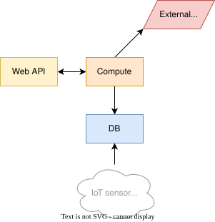

Study case - Multitier application performance
==============================================

The learning goals of this lab are:

- use available tools to identify slow and saturated components in a multitier application,
- improve the throughtput of a multitier application,
- reduce the response time of a multitier application.

Introduction
------------

A Web application provides a service to generate maps with real-time air pollution data. The structure of the application is shown below.

- The frontend is a Web API that accepts GET requests with country names such as `/airquality?country=france`. Supported countries are Switzerland, France, Germany, Italy, Spain (in lowercase).
- It forwards the requests to the compute module, which performs the main work.
  - The compute module queries the database for air pollution measurement data of the requested country.
  - It fetches a map from an external service like Google Maps.
  - It performs a computation to combines the data and the map to generate the final result.

The system is already implemented with all components in place. A Docker Compose file is provided to build and run the application.

> [!IMPORTANT]
> Your goal is to analyze the performance of this Web API and to improve the response time and throughput.

For this, you will need to:

- add observability to the system using Prometheus and Grafana,
- generate synthetic HTTP traffic,
- analyze the performance metrics,
- devise and implement strategies to improve the performance.

### Data freshness

The generated air pollution maps are based on two data sources with different freshness requirements:

- The air pollution measurement data changes constantly and must be fetched in real-time from the database.
- Maps from the external service only change every hour, but must be up-to-date with the latest version.

Observability
-------------

The Web API (file `api/app.py`) and the compute module (file `compute/app.py`) are already instrumented with Prometheus metrics.

You need to set up a monitoring stack to collect and visualize these metrics using Prometheus and Grafana.

- Add the Prometheus and Grafana services to the `compose.yml` file.
- Configure Prometheus to scrape the metrics both `http://api:5000/metrics` and `http://compute:5000/metrics`.
- Create a Grafana dashboard with a single time series graph that shows all the duration metrics from both services.

Maximum throughput measurement
------------------------------

Configure Locust to generate synthetic HTTP traffic that performs requests to the Web API. Each user should wait 1 second between requests.

Run Locust to determine the current maximum throughput. It should be between 2 and 10 requests per second.

Then define the realistic workload as about 50-60% of the maximum throughput.

Check that the system is stable under this workload.

Use this workload for the rest of the lab.

Performance analysis
--------------------

Determine the two types of bottlenecks in the system:

1. Slow components that increase the response time.
2. Saturated components that limit the throughput.

Use the `docker stats` command to observe the CPU utilization of all containers.

Use the Grafana dashboard to analyze the request duration metrics.

At the end of this step, you should have identified all slow and saturated components.

Improving the throughput
------------------------

The throughput is limited by the bottleneck component, i.e., the component with the highest utilization.

Devise and implement a strategy to increase the throughput of the system. This should be simple. Refer to the [Performance Mantras](https://www.brendangregg.com/methodology.html) for ways to improve the thoroughput.

You can use features provided by Docker Compose to achieve this goal.

After the change, measure the maximum throughput again using Locust. Did it improve?

Improving the response time
---------------------------

The response time is mainly affected by the slow components. You've already identified them in the performance analysis step.

Devise and implement a strategy to reduce the response time of the system. Again, refer to the [Performance Mantras](https://www.brendangregg.com/methodology.html).

This will require more work than improving the throughput. You may need to introduce new components.

After the change, measure the response time again using Locust. Did it improve?

Report
------

> [!IMPORTANT]
> Document all steps and the achieved results in a file named `Report.md`. Add a conclusion with what you learned in this lab.
